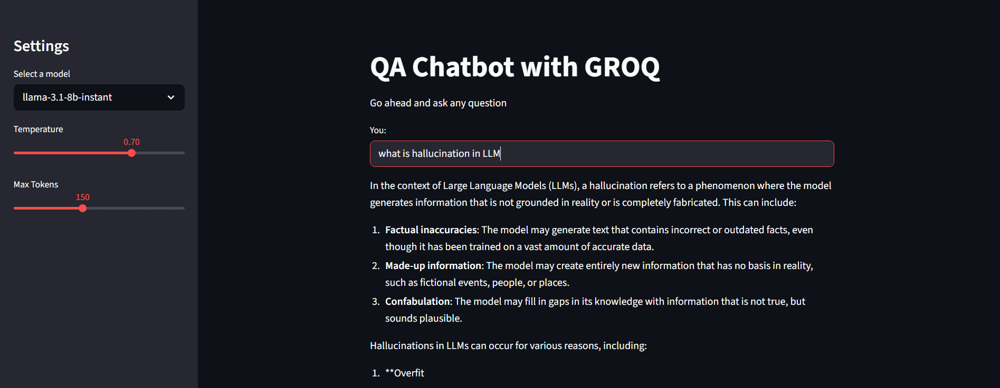
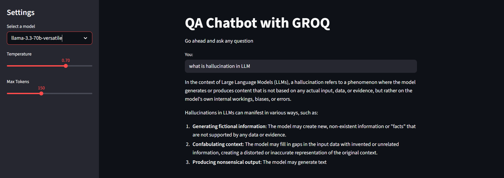
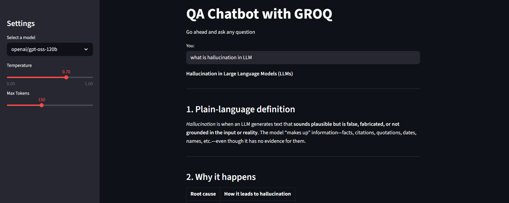

# ChatBot
# 🤖 Simple Q&A Chatbot using GROQ + LangChain + Streamlit

A lightweight AI-powered Q&A chatbot built using **LangChain**, **Groq LLMs**, and **Streamlit**.  
It allows users to interact with multiple LLM models and adjust response behavior in real time.

---

## 🚀 Features

- 🔥 Powered by Groq ultra-fast LLMs
- 🧠 Supports multiple models (Llama 3.1, Llama 3.3, GPT-OSS)
- 🎛️ Adjustable temperature and max token settings
- 💬 Simple chat-based Q&A interface
- 📊 LangSmith tracing enabled for monitoring
- ⚡ Built with Streamlit for fast UI development

---

## 🏗️ Tech Stack

- Python 🐍
- Streamlit 🎈
- LangChain 🦜🔗
- Groq API ⚡
- LangSmith 📊
- dotenv 🔐

---

## 📸 Output Screenshots

  

     
    <b>Model:</b> llama-3.1-8b-instant
  

   

  

     
    <b>Model:</b> llama-3.3-70b-versatile
  

   

  

     
    <b>Model:</b> openai/gpt-oss-120b
  

## 🚀 Live Demo

🔗 Try it here: https://chatbot-2-groq.streamlit.app/

---

